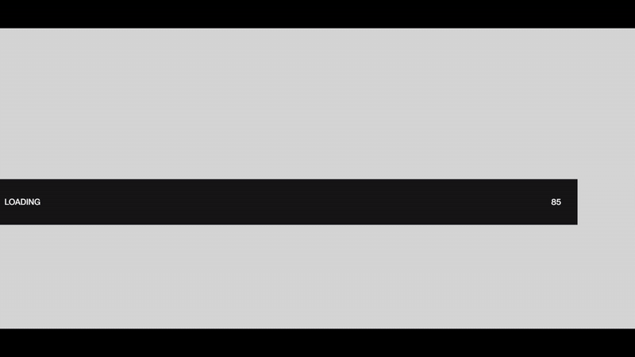
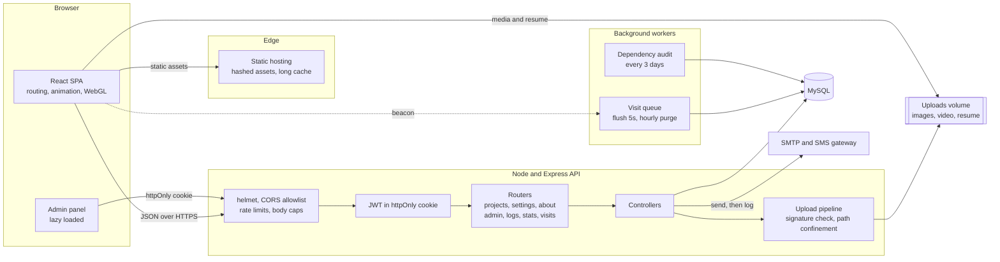
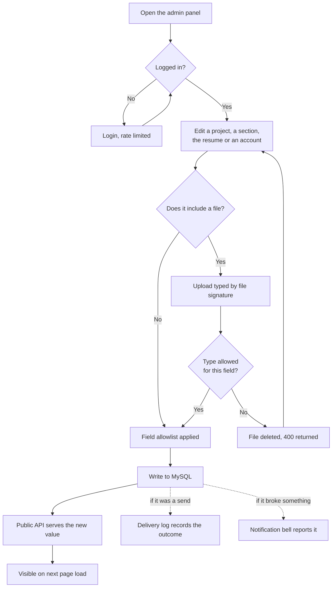
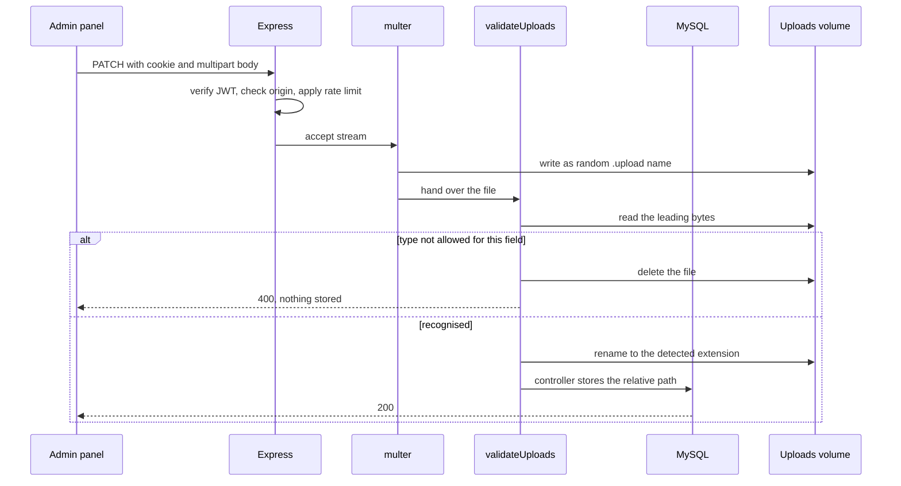
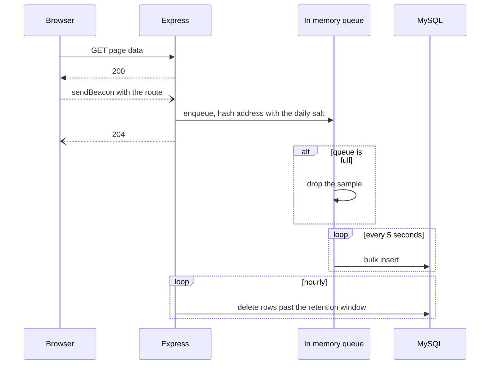
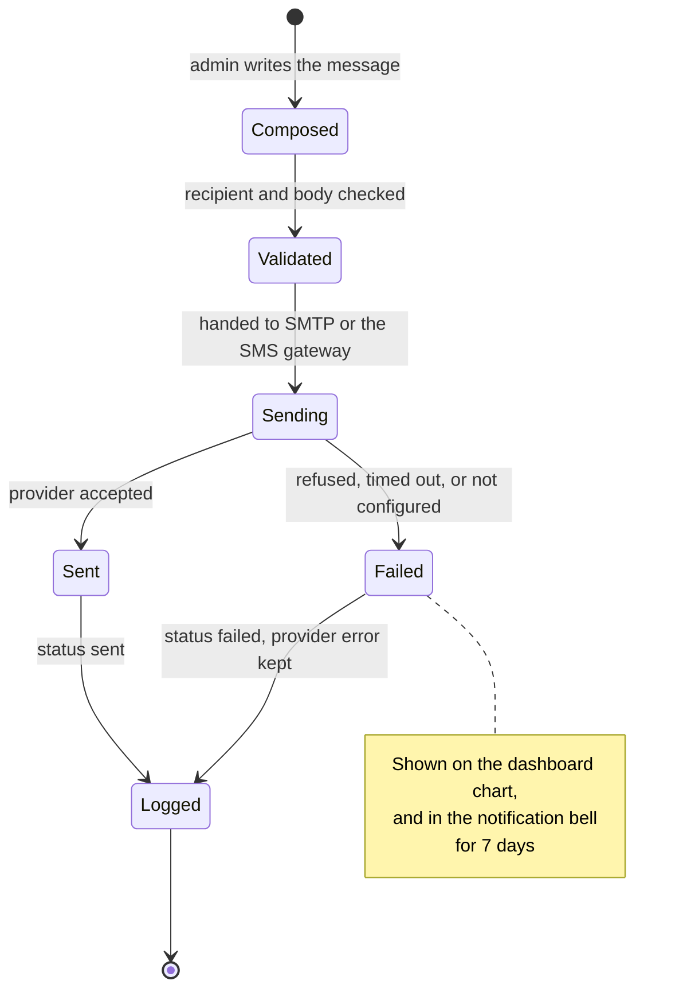

# Khalid Ahammed, portfolio

My portfolio site: the public site, the API behind it, and the admin panel I use
to keep it up to date. Live at
**[khalidahammed.com](https://khalidahammed.com)**.



Designed in Figma first. The file is public, no account needed:
[Portfolio website](https://www.figma.com/design/6vj7AuSx5mTlBdbnVBwX7V/Protfolio-website?node-id=0-1).

---

## Contents

- [Overview](#overview)
- [Feature list](#feature-list)
- [Architecture](#architecture)
- [How a change reaches the site](#how-a-change-reaches-the-site)
- [What happens on an admin write](#what-happens-on-an-admin-write)
- [What happens on a visit](#what-happens-on-a-visit)
- [Delivery](#delivery)
- [Data model](#data-model)
- [The stack](#the-stack)
- [Security](#security)
- [Performance](#performance)
- [Testing and verification](#testing-and-verification)
- [Running it locally](#running-it-locally)
- [Deploying](#deploying)
- [Repository layout](#repository-layout)
- [Known gaps](#known-gaps)
- [License](#license)

---

## Overview

A React single page app, an Express API, and MySQL. Content is managed through
an admin panel rather than hardcoded, so updating a project or a job title does
not require a redeploy.

The parts that took the most thought:

- Schema changes go through versioned migrations, applied under a database lock.
- Uploads are typed by reading the file's leading bytes, so the extension comes
  from what the file actually is.
- Every stored path passes through one function that keeps it inside the uploads
  directory.
- Visit tracking runs off the request path entirely, so it cannot slow a page
  down.

---

## Feature list

### The public site

| Route | What it is |
| --- | --- |
| `/` | Landing page: an interactive 3D bot that follows the cursor, scroll driven animation, and a technology marquee |
| `/projects` | All projects, filterable by category, in the order set in the panel |
| `/singleProject/:value` | One project: banner, image slider, video, live and source links, and the stack used |
| `/about-me` | Technology groups, employment history, education, achievements, and the resume download |
| `/coding-lab` | Competitive programming and experiment write ups |
| `/error` | Error page for a missing route or record |

Across all of them:

- Content comes from the database through the API. Headings, projects,
  technologies, jobs and awards are all editable.
- The resume is a live file. Upload a PDF in the panel and the download link
  serves it immediately, keeping the original filename. If no resume is
  published, the button is hidden.
- GSAP timelines and smooth scroll for motion. The 3D scene is lazy loaded so it
  does not block first paint.
- Per route metadata, so a shared project link previews as that project.

### The admin panel

Behind a login at `/admin-login`. Every route under `/admin` is gated.

| Section | What it does |
| --- | --- |
| **Dashboard** | Live counts, plus two charts: email and SMS delivery over 30 days, and visitor frequency over the same window |
| **Projects** | Create, edit, delete, reorder by dragging, and search. Banner images, thumbnails, slider images and video upload from here |
| **Settings, Technologies** | The technology groups on the About page |
| **Settings, Personal info** | Employment, education and achievements. Collapsible rows, drag to reorder, new entries appear at the top |
| **Settings, Resume** | Upload a PDF to replace the published one. The old file is deleted only after the database row updates |
| **Settings, Accounts** | Change your own password, add an administrator, remove one |
| **Mail and SMS** | Compose and send either, with delivery history below: search, filter by channel or status, select and delete, batch delete, pagination |
| **Notifications** | A bell reporting configuration and content problems |

### Behind the scenes

- **Visit tracking.** The browser sends a beacon, the server queues it in memory
  and flushes every five seconds. The queue has a fixed size, so a traffic spike
  drops samples instead of growing. Addresses are hashed with a salt that
  rotates daily and is never stored.
- **Retention.** Set a window in settings and older visit rows are removed
  automatically, hourly and at startup.
- **Delivery logging.** Email and SMS attempts are written to the database with
  their status and any provider error.
- **Notifications from live state.** Pending migrations, a resume row pointing at
  a missing file, uploads configured somewhere a deploy will erase, delivery
  failures in the last week, a single administrator account, an SMS gateway on
  plain HTTP. Each is checked when the panel asks, so an empty list means there
  is nothing outstanding. Clicking an item clears it; if the cause returns, so
  does the item.
- **Scheduled dependency audit.** `npm audit` runs in the background every three
  days and the result is cached, so the panel reads a stored value.

---

## Architecture

Two deployables and one database. The client is a static bundle, the API is a
Node process, and media sits on a mounted volume so a deploy does not remove it.



---

## How a change reaches the site

Editing content never involves a terminal or a rebuild.



### What happens on an admin write

Authentication happens before any upload bytes are accepted, and the file is
checked after it lands but before the database row is written.



### What happens on a visit

The response never waits on the recording.



### Delivery

Successes and failures are written to the same table, so the history in the
panel matches what actually happened.



### Data model

| Table | Holds | Notes |
| --- | --- | --- |
| `projects` | title, slug, description, ordering, media JSON | `value` is the public slug and cannot be set through the API, so an edit cannot repoint a URL |
| `settings` | technology groups, resume path and original filename | One row |
| `Admin` | username, bcrypt hash | The list endpoint never selects the hash |
| `AboutEntry` | employment, education and achievements | One shape for all three, split by `section`, ordered by `displayOrder` |
| `DeliveryLog` | every email and SMS attempt | Channel, recipient, status, and the provider error if there was one |
| `Visit` | page views | Route, timestamp, and a salted hash of the address. Removed on a retention window |
| `AppSetting` | small key and value pairs | Retention window, cached dependency audit |
| `schema_migrations` | which migrations have run | Written by the runner under a MySQL advisory lock |

---

## The stack

| Layer | Choice | Reason |
| --- | --- | --- |
| UI | React 19 | Native document metadata, which removed a dependency |
| Build | Vite 8 on Rolldown | Fast production builds and manual chunking |
| Styling | Tailwind 4 | Utility CSS with the theme pinned to explicit values |
| Motion | GSAP, Lenis, Framer Motion | GSAP for timelines, Lenis for scroll, Framer for route transitions |
| 3D | three.js, React Three Fiber, drei | The bot on the landing page, lazy loaded |
| Drag and drop | dnd-kit | Reordering projects and about entries, with keyboard support |
| Charts | Hand written SVG | Two shapes did not justify a charting library |
| API | Express 5 | Native async error forwarding |
| ORM | Sequelize 6 | Migrations stay explicit |
| Database | MySQL | What the host provides, and the data is relational |
| Auth | JWT in an httpOnly cookie, bcrypt | No token reachable from JavaScript |

---

## Security

Issues found and fixed while going through the codebase:

| Issue | What it allowed | Fix |
| --- | --- | --- |
| Open registration | Anyone could `POST /api/admin/reg` and get an admin session | Route removed. Accounts are created from a shell, or by an authenticated admin re-entering their own password |
| Hardcoded cookie secret | The signing key was the string `secret`, committed to the repository, so a session could be forged | Required from the environment, length checked, and must differ from the JWT secret |
| Uploads trusted the client | A file declaring `video/mp4` and named `payload.html` was written into a statically served directory | Type comes from the file signature, and the extension is assigned from that |
| Mass assignment | An edit could set any column, including media paths, which fed a delete | Explicit allowlists per route, and every stored path goes through one confinement helper |
| Path traversal | Stored paths were joined by hand and passed to `unlink` | One resolver rejecting absolute paths, backslashes, NUL bytes, and anything outside the uploads root |
| Username enumeration | An unknown username returned 404 naming it, a wrong password returned 401 | Both fail identically, and the hash comparison still runs when the account is absent so timing matches |
| Unauthenticated crash | A GET for a missing file threw inside an async callback and killed the process | Errors are passed to Express, and a failure mid stream aborts the socket |
| Path disclosure | Multer's absolute `destination` was stored and returned by the public API | Stripped before serialization |

Changing a password, adding an administrator or removing one each require the
actor's own password as well as a valid session.

Also in place: `helmet` with a restrictive CSP, an exact origin allowlist for
CORS with writes refused when `Origin` is missing, body size caps, per route
rate limits on separate buckets, TLS to the database in production, and a config
module that refuses to start on a missing or weak secret.

Dependency advisories went from 29 on the server (4 critical, 17 high) to 2
moderate, and from 30 on the client to 2. The remaining four have no fix that
does not introduce a regression, and each is written up in my deployment
runbook.

---

## Performance

The application used to ship as a single JavaScript file.

| | Before | Now |
| --- | --- | --- |
| Render blocking JS, gzip | 439.2 KiB | 221.4 KiB |
| Chunks | 1 | Vendors split by library, admin panel and 3D on demand |
| Production build | about 12s | under 1s |

The 3D stack is around 60 percent of the site's JavaScript. It downloads during
the 1.2 second delay before the bot mounts, so it appears at the same moment it
did before.

Generated filenames carry 32 random hex characters and are never reused, so they
get a one year immutable cache. Older title based filenames revalidate with an
ETag.

---

## Testing and verification

**Server tests.** 46 tests on the Node test runner, covering upload type
detection, path confinement, field allowlists, auth behaviour, and that every
model has a migration creating its table.

**CI.** Lint, build and the server suite on every push, on Linux. This is worth
having on a codebase developed on macOS: a `./Project/projectVideos` import of a
file named `ProjectVideos.jsx` resolves fine on a case insensitive filesystem
and fails on the runner.

**Visual regression.** The site had to look identical while React, Vite,
Tailwind and Express all went through major versions. A local harness serves the
previous build and the new one against the same fixture data, drives both with
Playwright across 9 routes and 3 viewports, and compares screenshots plus
computed styles, bounding boxes, element counts and metadata.

The Tailwind 3 to 4 upgrade was the case that needed it. Six changes altered
rendering without producing an error: utilities moved into a cascade layer so an
unlayered reset started overriding them, custom px breakpoints sorted before the
framework's rem defaults, font size utilities switched from fixed line heights
to ratios, the default palette moved to OKLCH, the `*-opacity-*` utilities were
removed, and commas in arbitrary values stopped being rewritten as spaces.

**API contract.** 28 requests recorded as status, content type, security headers
and normalised body, so a change in response shape shows up as a diff.

The visual harness is not in this repository. It carries a copy of production
media as fixtures.

---

## Running it locally

Node 24 and a MySQL database.

```bash
# API
cd server
cp .env.example .env        # database, secrets, allowed origins
npm ci
npm run migrate             # schema is explicit, never synced at boot
npm run admin:bootstrap     # prompts for the first admin password
npm start

# Client
cd client
cp .env.example .env        # VITE_API_URL
npm ci
npm run dev
```

`npm run seed:local` loads a snapshot of content and media into the local
database. It backs up existing rows first and refuses to run when `NODE_ENV` is
production.

---

## Deploying

The full sequence is in a runbook kept outside this repository, since it
describes a specific host. The general points:

- The server will not start without `COOKIE_SECRET`, `REMOTE_CLIENT_APP` and a
  strong `ADMIN_SECRET`.
- `sequelize.sync()` does not run at boot. Run `npm run migrate`.
- Point `UPLOADS_DIR` at a mounted volume, or the next deploy removes every
  uploaded file.
- `TRUST_PROXY_HOPS` has to match the number of proxies in front of the app.

The environment file is short by design. It previously held 37 keys, 19 of which
no code read. Values that did not vary between machines are now constants in the
code, leaving secrets and the few things that genuinely differ.

---

## Repository layout

```
client/          React SPA
  src/
    animations/  GSAP and Lenis timelines, page transitions
    components/  UI, split by public site and admin panel
      Admin/     Charts, delivery tables, settings subsections
    pages/       Routes, with the admin panel lazy loaded
    hooks/       About entries, visit tracking
    axios/       API bindings, one module per resource
server/          Express API
  controllers/   Request handling
  middlewares/   Auth, uploads, validation, rate limits, errors
  models/        Sequelize models
  migrations/    Versioned schema, applied under an advisory lock
  scripts/       Admin bootstrap, migration runner, local seeding
  test/          Node test runner
  utils/         Path confinement, media signatures, delivery log,
                 visit queue, scheduled audit
```

---

## Known gaps

- No staging environment.
- Backup and restore is written but has not been rehearsed end to end.
- Email and SMS are logged, but not tested against provider sandboxes.
- Rate limits are in process, so they reset on restart and are not shared
  between instances. This belongs at the proxy.
- The React Compiler lint plugin reports 37 warnings about effects that set
  state. Each is a behaviour change, so they are on hold while the rendering has
  to stay identical.
- The 3D model is 1.4 MB and CC BY-NC licensed.

---

## License

**All rights reserved. View only.** See [LICENSE](LICENSE).

This repository is public so it can be read, not reused. You are welcome to read
the code and learn from it. You may not copy it, redistribute it, deploy it, or
present it as your own portfolio.

It is not open source. An earlier version of this file used CC BY-ND, which
permits verbatim redistribution as long as the author is credited. That allowed
the thing the license was meant to prevent.

For any other use, ask: khalidahammeduzzal@gmail.com
